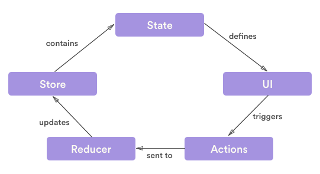

# Redux

Following in the steps of [Flux](http://facebook.github.io/flux), [CQRS](https://martinfowler.com/bliki/CQRS.html), and [Event Sourcing](https://martinfowler.com/eaaDev/EventSourcing.html), [Redux](http://redux.js.org) attempts to make state mutations predictable by imposing certain restrictions on how and when updates can happen.
These restrictions are reflected in the three principles of Redux.

#### Single source of truth

The state of your whole application is stored in an object tree within a single store.

#### State is read-only

The only way to change the state is to emit an action, an object describing what happened.

#### Changes are made with pure functions

To specify how the state tree is transformed by actions, you write pure reducers.

## Basics

### Terminology

**Actions** are payloads of information that send data from your application to your store.
We adhere to the [Flux Standard Action](https://github.com/acdlite/flux-standard-action) format.
Several high profile projects adhere to this standard.
Also, it's well documented.
Here's the gist:

	{
		type: "action_type", (required)
		meta: {...}, (optional)
		payload: {...}, (optional.  If error, then this is an Error object.)
		error: true (optional)
	}

**Action Creators** are functions that create actions, specifically, `Dispatch Actions`.

	function addTodo(text) {
		return {
			type: 'add_todo',
			payload: { text }
		}
	}
	
**Reducers** specify how the application's state changes in response to actions.

**Store** brings it all together by holding redux state, as well as methods to getState, dispatch, and subscribe.  It's important to note that you'll only have a single store in a Redux application.

### Basic Flow

## Async and Data Shape

### Asynchronous Dispatch of Actions

[redux-thunk](https://github.com/gaearon/redux-thunk) is used for asynchronous dispatch of actions, allows us to dispatch multiple actions, and allows us to conditionally dispatch actions within an action creator.
The typical usage for this library is in invoking remote services.
The concrete example below illustrates this point.

### Data Structure for Redux State

The data representation as the results of an API fetch may not exactly match the best representation, or shape, that would be optimal for slicing and dicing various perspectives, for example, different components of a UI.

Therefore, Two rules:

1. Minimize duplication, so that updates, edits, and deletes are fast.
2. Information is retrievable quickly.

Which takes us to the next point.

### Selectors

Normalized, possibly indexed, data structures allow us to quickly compose data in some format suitably optimized for specific presentations.
The key word here is `compose`, which so far we haven't talked about it being done.
Hence, selectors, which implements the concept of [Memoization](https://en.wikipedia.org/wiki/Memoization):  "An optimization technique used primarily to speed up computer programs by storing the results of expensive function calls and returning the cached result when the same inputs occur again".

[reselect](https://github.com/reactjs/reselect) and [re-reselect](https://github.com/toomuchdesign/re-reselect) are by far the most commonly used selector libraries in the developer community.
The difference between the 2 are is that reselect computes results purely from redux state data, where as re-reselect accepts additional inputs (ex. get teams of subscriberOrg given subscriberOrgId).
re-reselect is just an extension of reselect.

* Selectors can compute derived data, allowing Redux to store the minimal possible state.
* Selectors are efficient. A selector is not recomputed unless one of its arguments change.
* Selectors are composeable. They can be used as input to other selectors.

To summarize, the differentiation between redux state and selector results is raw optimized data structure vs derived data suitable for presentation.

### Concrete Example

	Initial State
	{
		teamById: {},
		teamIdsBySubscriberOrgId: {},
		currentTeamIdBySubscriberOrgId: {},

		working: false,
		error: null,
		errorMeta: {}
	}
	
	State 1
	{
		teamById: {
			'00000000-0000-0000-0000-111111111111': {
				teamId: '00000000-0000-0000-0000-111111111111',
				subscriberOrgId: '11111111-0000-0000-0000-000000000000',
				name: 'Software Development',
				active: true,
				primary: false,
				preferences: {}
			},
			'00000000-0000-0000-0000-222222222222': {
				teamId: '00000000-0000-0000-0000-222222222222',
				subscriberOrgId: '11111111-0000-0000-0000-000000000000',
				name: 'All',
				active: true,
				primary: true,
				preferences: {}
			},
			'00000000-0000-0000-0000-333333333333': {
				teamId: '00000000-0000-0000-0000-333333333333',
				subscriberOrgId: '22222222-0000-0000-0000-000000000000',
				name: 'All',
				active: true,
				primary: true,
				preferences: {}
			}
		},
		teamIdsBySubscriberOrgId: {
			'11111111-0000-0000-0000-000000000000': [
				'00000000-0000-0000-0000-111111111111',
				'00000000-0000-0000-0000-222222222222'
			],
			'22222222-0000-0000-0000-000000000000': [
				'00000000-0000-0000-0000-333333333333'
			]
		},
		currentTeamIdBySubscriberOrgId: {
			'11111111-0000-0000-0000-000000000000': '00000000-0000-0000-0000-222222222222',
			'22222222-0000-0000-0000-000000000000': '00000000-0000-0000-0000-333333333333'
		},

		working: true,
		error: null,
		errorMeta: {}
	}

	State 2
	{
		teamById: {},
		teamIdsBySubscriberOrgId: {},
		currentTeamIdBySubscriberOrgId: {},

		working: false,
		error: null,
		errorMeta: {}
	}
	
	Teams(subscriberOrgId=11111111-0000-0000-0000-000000000000)
	[
		{
			teamId: '00000000-0000-0000-0000-111111111111',
			subscriberOrgId: '11111111-0000-0000-0000-000000000000',
			name: 'Software Development',
			active: true,
			primary: false,
			preferences: {}
		},
		{
			teamId: '00000000-0000-0000-0000-222222222222',
			subscriberOrgId: '11111111-0000-0000-0000-000000000000',
			name: 'All',
			active: true,
			primary: true,
			preferences: {}
		}	
	]
	
### Variations on Data Shape

#### Users

TODO: document existing

#### Conversations

TODO: document existing

## Client-Side Specific Data

Things like message thread "expanded" are typically client-side only.
Some information may be for the same react component but for different context, for example different scroll position for different conversations.
Some information is the same for the same react component for any context (ascending or descending messages).
Some information is stored in the backend (i.e. global user preferences, unread messages), maintained across login sessions.
Some information is stored in the backend (i.e. last window position, size), maintained across login sessions per client.

The point is is that there is many different "states", that have different lifetimes and applicability.
This "state" needs to be stored somewhere.

There are several choices.

1. React component state
2. Route (bookmark-able)
3. Redux state (application state, dependent on persistence policy described below)
4. Cookie
5. User preferences (in backend)
6. User private preferences (in backend)

Bottom line is make an intelligent assessment, and run with it.  Point is at least think about it.

# Bootstrap

## Persistence of Store

Habla off-line usage doesn't make much sense, since real-time communication is at it's core.
But there may be use-cases for offline storage, yet to be determined.

In the meantime, storage of redux state is supported.
What and when, you ask?

### Web

For the webapp, [redux-persist](https://github.com/rt2zz/redux-persist) is used to store redux state to HTML 5 Local Storage.

Since locally stored data is sandboxed by domain origin, care must be taken with stored data, since different users from the same client can login to the same domain.
There are some hurdles to overcome.

The simple case is when a user logs out, we blow away the locally stored redux state.

The more difficult case is that in the absence of an explicit logout is that we are reduced to receiving a single event: `onbeforeunload`.
This can mean 2 things:  the user navigated elsewhere (ex. google.com), or they closed the browser.
We can safely assume that if the user closes the browser, that this is equivalent to an explicit logout.
But the complication is that if the user navigates away, for example when they add an Habla integration triggering an [OAuth 2.0 Authorization Code Grant](https://tools.ietf.org/html/rfc6749#section-4.1) process, we can't assume a logout.
When the user comes back at the end of this process, we'd like to have their data essentially locally cached, including current state.

To summarize, client-side persistence is beneficial for several reasons, but 2 security concerns needs to be addressed.
The first is that a user from the same browser client does not have access to the data of another user from the same browser client.
We handle this by further sandboxing by userId, and ensuring that only the data for a single user exists at any time.
The second is that we need a policy of how long to keep local data, specifically redux state.
This is yet to be determined, but we still need to flush out the usage of available storage mechanisms in order make more informed decisions on what can and can't be done.

Caveat:  Session Storage maybe more suitable, so continual assessment is necessary as use-cases come up.
Switching redux-persist storage engines is a simple configuration change.

Refer to [Client-Side Storage](https://www.html5rocks.com/en/tutorials/offline/storage/) for a comparison of the various choices.
The main choices are Web Storage, Web SQL Database, Indexed Database, and File Access.

### Mobile

TODO: [Async Storage](http://facebook.github.io/react-native/docs/asyncstorage.html#content)? which can be the storage engine for redux-persist.

### Desktop

TODO:

## Sessions

Session refers to the time between when a user logs in and the user logs out, although as described above, logout is commonly indeterminate.
Session also refers to some critical identifiers identifying a session, JWT in our case.

Session is closely tied to Redux store (for when to persist and rehydrate, as well as sandboxing) and websocket notifications (to handle connect, disconnect, and reconnect).
It is also tied to routing (ie. navigation), since we have protected pages, and forwarding to target requested page after challenge is a common pattern.

This data and behavior is encapsulated in a single `session` object to at least understand, simplify, and maintain these complex interactions.
Obviously, there are interdependencies with various parts of the system, so this is an attempt to at least keep that under control.

## Realtime Notifications via WebSockets

When a login session is instantiated, websocket connection is initialized, allowing for realtime notification of changes.
A (somewhat) common Messaging.js class is responsible for listening and routing these realtime events.

In relation to our redux process above, it's simply another trigger.
Hence, there is a messageActionAdapter.js that ties Messaging events to Redux action creators.

Ultimately, adding realtime notification functionality to our Redux implementation requires absolutely no React Component render implementation changes.

## Smart Containers vs Dumb Components

TODO: Gonzalo?

## Additional References

* [Five Tips for Working with Redux in Large Applications](https://techblog.appnexus.com/five-tips-for-working-with-redux-in-large-applications-89452af4fdcb)

* [Idiomatic Redux: Thoughts on Thunks, Sagas, Abstraction, and Reusability](http://blog.isquaredsoftware.com/2017/01/idiomatic-redux-thoughts-on-thunks-sagas-abstraction-and-reusability/)

* [Recommendations for Best Practices Regarding Action-Creators, Reducers, and Selectors](https://github.com/reactjs/redux/issues/1171)

## Where's This Stuff in Code

* Redux Store: **src/store.js**

* Actions: **src/actions/***

* Reducers: **src/reducers/***

* Selectors: **src/selectors/***

* Redux State -> React Components: **src/containers/\*\*/*.js mapStateToProps(state)**

* Session: **src/session.js**

Action Triggers

* React Components -> Action Creators: **src/containers/\*\*/*.js mapDispatchToProps(dispatch)**

* Websockets Notifications: **src/actions/messagingActionAdapter.js**

## Still Left

* Consistent representation of never retrieved data, for example, "null".

* Switch errorMeta to just meta.

* Consistent checking for when to retrieve data.

* Consistent error handling pattern and implementation.

* Client-side specific data needs to be flushed out.

* Is "current..." in state necessary?  Are we using it?

